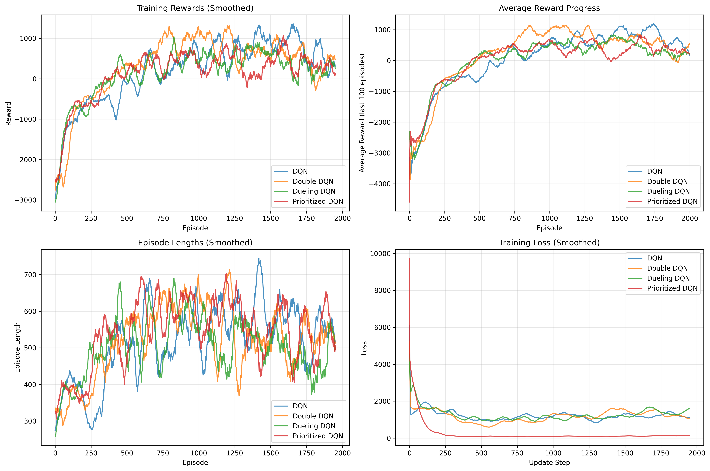

# AI Midterm Group 6 — DQN Variants Comparison

Proyek ini membandingkan berbagai varian Deep Q-Network (DQN) untuk menyelesaikan environment permainan berbasis reinforcement learning menggunakan PyTorch dan Gymnasium.  
Model yang dibandingkan meliputi:

- DQN (Deep Q-Network)
- Double DQN
- Dueling DQN
- Prioritized Experience Replay DQN

---

## Setup dan Instalasi

### 1. Clone repository
```bash
git clone https://github.com/haidarpriatama/AI-Midterm-Group-6.git
cd AI-Midterm-Group-6
```

### 2. Buat dan aktifkan virtual environment
```bash
python3 -m venv venv
source venv/bin/activate  # Linux/Mac
venv\Scripts\activate     # Windows
```

### 3. Install dependencies
```bash
pip install -r requirements.txt
```

---

## Training dan Evaluasi

### Jalankan training dan perbandingan model
```bash
python train_and_compare.py
```

Script ini akan:
- Melatih keempat varian DQN secara berurutan.
- Menyimpan model dan hasil evaluasi.
- Menghasilkan grafik perbandingan performa.

### Struktur output
```
models/
├── dqn_model.pth
├── double_dqn_model.pth
├── dueling_dqn_model.pth
└── prioritized_dqn_model.pth

outputs/
├── training_comparison.png
├── evaluation_comparison.png
└── results_summary.json
```

---

## Testing dan Pembuatan Video

Setelah training selesai, jalankan:
```bash
python test_and_save_video.py
```

Script ini akan mmenguji dan merekam **keempat varian DQN** ke dalam satu video perbandingan, menjalankan agen dalam environment, dan menyimpan hasilnya sebagai video untuk visualisasi performa model.

---

## Hasil Training (Contoh)

| Model                    | Mean Reward | Success Rate (%) | Avg Training Time (s) | Episodes | Final Epsilon |
|---------------------------|-------------|------------------|------------------------|-----------|----------------|
| DQN                      | 1099.89     | 91.3             | 5324.18               | 2000      | 0.0500         |
| Double DQN               | 984.87      | 88.6             | 5491.26               | 2000      | 0.0500         |
| Dueling DQN              | 554.24      | 72.1             | 5437.61               | 2000      | 0.0500         |
| Prioritized Replay DQN   | 1267.31     | 94.7             | 5680.52               | 2000      | 0.0500         |

---

## Visualisasi Hasil Training

Grafik Performa Selama Training




---

## Anggota Kelompok

Kelompok 6 - Kecerdasan Buatan C  

Anggota:
- Haidar Rafi Apta Priatama  
- Ahmad Zaydan Iswandi
- Shofwan Thufail Akhmad
- Raditya Gilang Daneshworo

---
